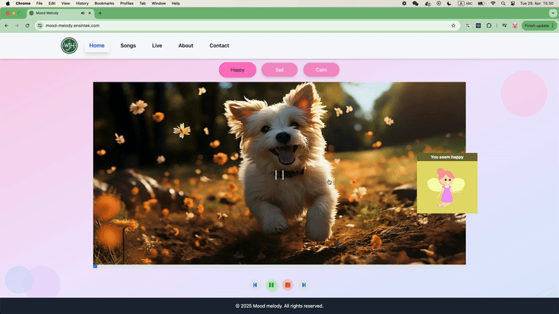
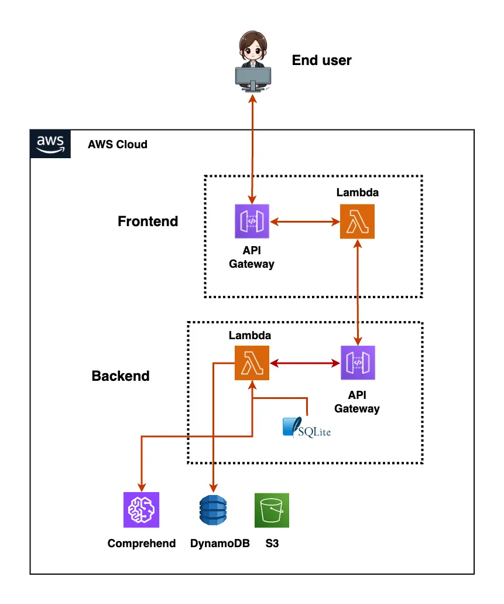
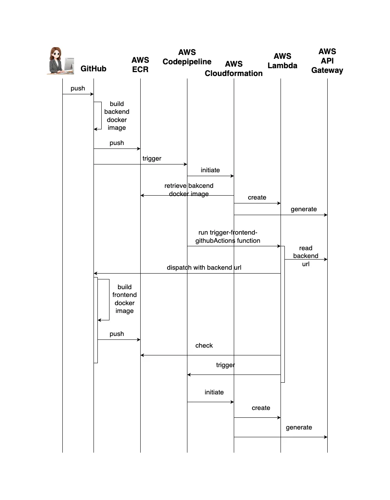

**App Website:** https://mood-melody.ensintek.com/

## Developer's Note

Over the course of one year, I built this AI-powered project solo—making 1,400 + commits and 1,800 + CI/CD runs—authored and maintained the full application codebase (from backend services to frontend components), and managed end-to-end CI/CD pipelines. It demonstrates my end-to-end ownership of infrastructure-as-code, serverless backends, and a responsive frontend, and reflects my dedication and problem-solving skills in architecting, deploying, and scaling a full-stack solution.

## Table of Contents

- [About](#about)
- [Tech Stack](#tech-stack)
- [Features](#features)
- [Live Demo](#live-demo)
- [Prerequisites](#prerequisites)
- [Getting Started](#getting-started)
- [Architecture](#architecture)
- [CI/CD & Deployment](#ci-cd-deployment)
- [License](#license)
- [Contact](#contact)

---

## About

Mood Melody is an intelligent music player that pairs every song with a mood‑matched image. Tap a mood button or type in your vibe the AI then analyzes your input, curates the perfect soundtrack, and displays an evocative visual for a fully immersive experience.

[](https://github.com/Lumi669/mood_melody_aws/commits)

[](https://github.com/Lumi669/mood_melody_aws/actions/workflows/build-backend.yml)

[](https://github.com/Lumi669/mood_melody_aws/actions/workflows/build-frontend.yml)

[](https://mood-melody.ensintek.com/)

[](LICENSE)

## Tech Stack

| Tier                  | Technologies                                                   |
| --------------------- | -------------------------------------------------------------- |
| Frontend              | Next.js, React, Tailwind, Docker, Typescript                   |
| Backend               | AWS Lambda (Node.js), Express, Serverless , Docker, Typescript |
| Database              | DynamoDB, SQLite                                               |
| AI/NLP                | AWS Comprehend                                                 |
| CI/CD                 | GitHub Actions, AWS CodePipeline, CloudFormation               |
| Other Infrastructures | S3, API Gateway, IAM, CloudWatch, Parameter Store              |

---

## Features

- 🎵 Play/pause tracks based on your mood
- 📊 Mood analytics based on your text input
- AI-Powered Curation: Emotion detection via NLP for spot-on song with its linked image
- 🔒 Input validation & sanitization to guard against malicious payloads
- ⏱️ Rate limiting on backend API endpoints to prevent abuse and spikes
- 🚀 Serverless, scales on AWS Lambda
- 🔄 CI/CD setup via GitHub Actions & AWS CodePipeline
- 🐳 Dockerized for easy AWS deployment via ECR

---

## Live Demo



> Click a mood button and watch the soundtrack sync with an evocative AI-picked image!

## Prerequisites

- Node.js ≥ 20
- Docker
- AWS CLI & credentials configured (for both local dev and deployment)

---

## Getting Started

1. **Clone** the repo

   ```bash
   git clone https://github.com/Lumi669/mood_melody_aws.git
   cd mood_melody_aws

   ```

2. Install dependencies

#### mood_melody_aws

```bash
pnpm install
```

#### mood_melody_aws/backend

```bash
cd backend && pnpm install
```

#### mood_melody_aws/frontend

```bash
cd ../frontend && pnpm install
```

3. Run locally

#### in two separate shells:

```bash
cd backend && pnpm run build && pnpm run start
cd frontend && pnpm run build && pnpm run start
```

App will be available at: http://localhost:3000

### Run local app with docker

1. mood_melody_aws/backend

#### build backend image

```bash
docker build -t my-backend -f backend/Dockerfile backend
```

#### Run it, mounting the local DB

```bash
docker run -d --name my-backend \
 -p 9000:8080 \
 -v "$(pwd)/backend/moodmelodydatabase.db:/var/task/moodmelodydatabase.db" \
 my-backend
```

#### test backend working or not

```bash
curl -i -XPOST http://localhost:9000/2015-03-31/functions/function/invocations \
 -H "Content-Type: application/json" \
 -d '{"route":"GET /songs"}'
```

HTTP/1.1 200 OK
Date: Fri, 25 Apr 2025 20:53:59 GMT
Content-Length: 423
Content-Type: text/plain; charset=utf-8

{"statusCode":200,"headers":{"x-powered-by":"Express","access-control-allow-origin":"\*","x-ratelimit-limit":"5","x-ratelimit-remaining":"4","date":"Fri, 25 Apr 2025 20:53:59 GMT","x-ratelimit-reset":"1745614470","content-type":"application/json; charset=utf-8","content-length":"57","etag":"W/\"39-FqPhC/ocgcZW6apeUQPxYsdw7lc\""},"isBase64Encoded":false,"body":"\"Welcome to the backend of the mood-melody app .......//\""}%

2. mood_melody_aws/frontend

- build frontend image

```bash
  docker build -t my-frontend \
  -f frontend/Dockerfile \
  frontend \
  --build-arg NEXT_PUBLIC_API_URL_0=http://my-backend:9000/2015-03-31/functions/function/invocations
```

- run frontend

```bash
  docker rm -f my-frontend
  docker run -d \
  --name my-frontend \
  --network moodmelody_net \
  -p 7001:7000 \
  -e NEXT_PUBLIC_API_URL_0=http://my-backend:9000/2015-03-31/functions/function/invocations \
  my-frontend
```

app is available at http://localhost:7001/
note: data is not populated

## Architecture

<details>
  <summary>🖼️ Click to view full architecture diagram</summary>

  

</details>

For an interactive tour, see the in-app Tech & Architecture page:  
🔗 https://mood-melody.ensintek.com/about/tech/architecture

<a name="ci-cd-deployment"></a>

## CI/CD & Deployment

<details>
  <summary>🖼️ Click to view full deployment diagram</summary>

  

</details>

For an interactive tour, see the in-app Tech & Architecture page:  
🔗 https://mood-melody.ensintek.com/about/tech/cicd

## License

This project is licensed under the PolyForm Noncommercial 1.0.0 license.
See the LICENSE file for details. Commercial use is prohibited without a separate paid license.

## Contact

Lumi669 – wangjinghuan@yahoo.com
