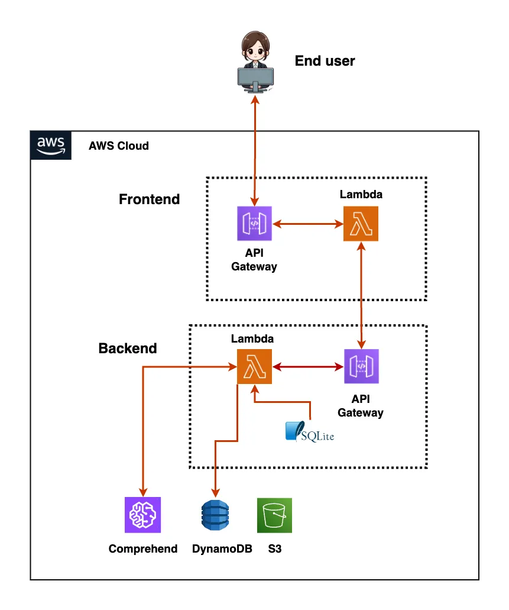

## Developer's Note

Built solo over the course of a year—with 1,300+ commits and 1,700+ CI/CD runs—this project highlights my end-to-end ownership of everything from infrastructure-as-code and serverless backends to a responsive AI-driven frontend. It reflects my dedication and problem-solving skills in architecting, deploying, and maintaining a scalable full-stack application.

## Table of Contents

- [About](#about)
- [Tech Stack](#tech-stack)
- [Features](#features)
- [Live Demo](#live-demo)
- [Prerequisites](#prerequisites)
- [Getting Started](#getting-started)
- [Local Development](#local-development)
- [Architecture](#architecture)
- [CI/CD & Deployment](#ci-cd--deployment)
- [License](#license)
- [Contact](#contact)

---

## About

Mood Melody is an intelligent music player that pairs every song with a mood‑matched image. Tap a mood button or type in your vibe the AI then analyzes your input, curates the perfect soundtrack, and displays an evocative visual for a fully immersive experience.

[](https://github.com/Lumi669/mood_melody_aws/commits)

[](https://github.com/Lumi669/mood_melody_aws/actions/workflows/build-backend.yml)

[](https://github.com/Lumi669/mood_melody_aws/actions/workflows/build-frontend.yml)

[](https://mood-melody.ensintek.com/)

[](LICENSE)

## Tech Stack

| Tier                  | Technologies                                                   |
| --------------------- | -------------------------------------------------------------- |
| Frontend              | Next.js, React, Tailwind, Docker, Typescript                   |
| Backend               | AWS Lambda (Node.js), Express, Serverless , Docker, Typescript |
| Database              | DynamoDB, SQLite                                               |
| AI/NLP                | AWS Comprehend                                                 |
| CI/CD                 | GitHub Actions, AWS CodePipeline, CloudFormation               |
| Other Infrastructures | S3, API Gateway, IAM                                           |

---

## Features 🎵

- 🎵 Play/pause tracks based on your mood
- 📊 Mood analytics based on your text input
- AI‑Powered Curation: Emotion detection via NLP for spot‑on song and image pairing
- Serverless, scales on AWS Lambda
- CI/CD setup
- Docker

---

## Live Demo 🔥


> Click a mood button and watch the soundtrack sync with an evocative AI-picked image!

## Prerequisites

- Node.js ≥ 20
- Docker
- AWS CLI & credentials configured (for both local dev and deployment)

---

## Getting Started

1. **Clone** the repo

   ```bash
   git clone https://github.com/Lumi669/mood_melody_aws.git
   cd mood_melody_aws

   ```

2. Install dependencies

### mood_melody_aws

pnpm install

### backend

cd backend && pnpm install

### frontend

cd ../frontend && pnpm install

3. Run locally

### in two separate shells:

cd backend && pnpm run build && pnpm run dev
cd frontend && pnpm run build && pnpm run dev

App will be available at: http://localhost:3000

To see the health at a glance, check the badges above or visit:

CI runs: https://github.com/Lumi669/mood_melody_aws/actions

Live site: https://mood-melody.ensintek.com/

### Run local app with docker

#### at root i.e mood_melody_aws

1. backend

#### build backend image

docker build -t my-backend -f backend/Dockerfile backend

#### Run it, mounting the local DB

docker run -d --name my-backend \
 -p 9000:8080 \
 -v "$(pwd)/backend/moodmelodydatabase.db:/var/task/moodmelodydatabase.db" \
 my-backend

#### test backend working or not

curl -i -XPOST http://localhost:9000/2015-03-31/functions/function/invocations \
 -H "Content-Type: application/json" \
 -d '{"route":"GET /songs"}'

HTTP/1.1 200 OK
Date: Fri, 25 Apr 2025 20:53:59 GMT
Content-Length: 423
Content-Type: text/plain; charset=utf-8

{"statusCode":200,"headers":{"x-powered-by":"Express","access-control-allow-origin":"\*","x-ratelimit-limit":"5","x-ratelimit-remaining":"4","date":"Fri, 25 Apr 2025 20:53:59 GMT","x-ratelimit-reset":"1745614470","content-type":"application/json; charset=utf-8","content-length":"57","etag":"W/\"39-FqPhC/ocgcZW6apeUQPxYsdw7lc\""},"isBase64Encoded":false,"body":"\"Welcome to the backend of the mood-melody app .......//\""}%

2. frontend

- build frontend image

  docker build -t my-frontend \
  -f frontend/Dockerfile \
  frontend \
  --build-arg NEXT_PUBLIC_API_URL_0=http://my-backend:9000/2015-03-31/functions/function/invocations

- run frontend

docker rm -f my-frontend  
docker run -d \
 --name my-frontend \
 --network moodmelody_net \
 -p 7001:7000 \
 -e NEXT_PUBLIC_API_URL_0=http://my-backend:9000/2015-03-31/functions/function/invocations \
 my-frontend

app is available at http://localhost:7001/
note: data is not populated

## Architecture 🎨

<details>
  <summary>🖼️ Click to view full architecture diagram</summary>

  

</details>

For an interactive tour, see the in-app Tech & Architecture page:  
🔗 https://mood-melody.ensintek.com/about/tech/architecture

## CI/CD & Deployment 📦

<details>
  <summary>🖼️ Click to view full deployment diagram</summary>

  

</details>

For an interactive tour, see the in-app Tech & Architecture page:  
🔗 https://mood-melody.ensintek.com/about/tech/cicd

## License

This project is licensed under the PolyForm Noncommercial 1.0.0 license.
See the LICENSE file for details. Commercial use is prohibited without a separate paid license.

## Contact

Lumi669 – wangjinghuan@yahoo.com
Project Link: https://github.com/Lumi669/mood_melody_aws
